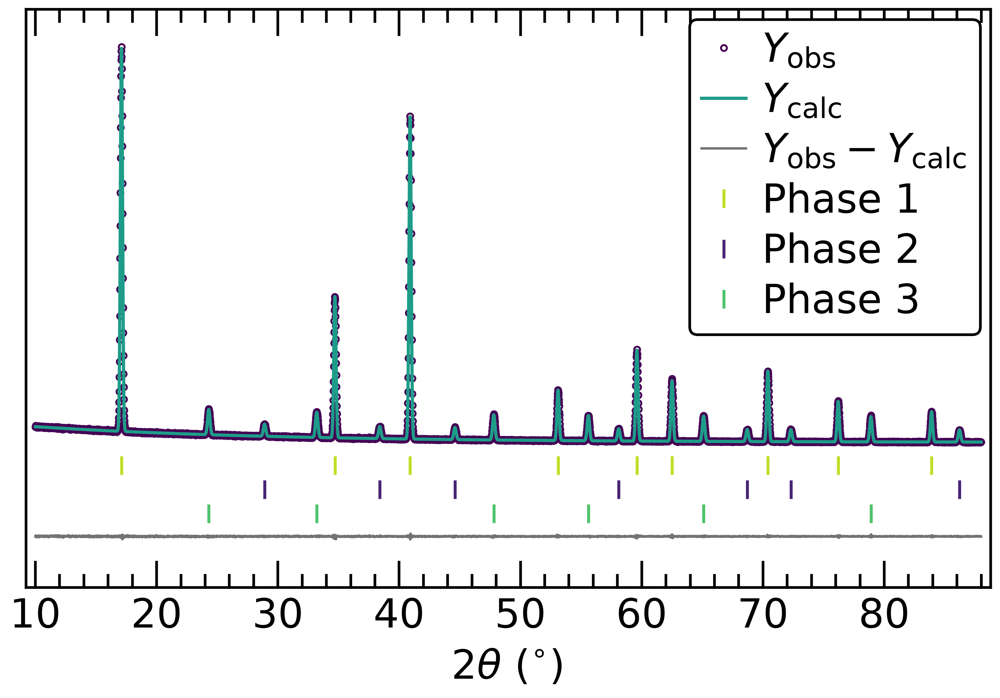

# plot_rietveld_ticks.py

Turns TOPAS Rietveld output into a publication-ready figure: observed data, calculated pattern and difference curve, with every phase drawn as its own row of *hkl* tick marks. Runs from the command line, finds the data files itself, and asks for anything you have not supplied.


*Generated from `docs/EXAMPLE_lab_data.txt` and its three phase files, at 5 × 3 inches.*


*The same script in Q, from `docs/EXAMPLE_synchrotron_data.txt`.*

**The data in both figures is included only to demonstrate the plotting and does not correspond to any real material, measurement or research project.**

## Requirements

Python 3.8 or newer, plus two libraries:

```
py -m pip install numpy matplotlib
```

On macOS or Linux, use `python3` in place of `py`.

## Data format

Two kinds of file, both written by TOPAS, both comma- or whitespace-separated.

**The pattern**, from `Out_X_Yobs_Ycalc_Diff`. Four or five columns, with a comment header naming them. Both layouts are recognised automatically — the extra `SigmaYobs` column is read and ignored:

```
'y-axis saved as y
'x,mysample.xy,Ycalc,Diff
5.00000,2220,0.000000,0.000000
```

```
'y-axis saved as y
'x,mysample.xye,SigmaYobs,Ycalc,Diff
2.038,19955,141.262168,0.000000,0.000000
```

| Column | Meaning |
| --- | --- |
| `x` | 2θ, degrees |
| *(named after the source file)* | observed intensity |
| `SigmaYobs` | uncertainty, optional |
| `Ycalc` | calculated intensity |
| `Diff` | Yobs − Ycalc |

Points where `Ycalc` is zero are treated as outside the refined range and left off the plot, so an excluded low-angle region does not drag the calculated curve to the baseline.

**The reflection positions**, one file per phase, from `Create_2Th_Ip_file`. Two columns, of which only the first is used:

```
   17.100000   100.000000
   34.700000   100.000000
```

| Column | Meaning |
| --- | --- |
| 2θ | reflection position, degrees — plotted as a tick |
| `Ip` | calculated intensity before the scale factor; not plotted |

Files must end in `_2Th_Ip.txt`. Everything before that is free: `mysample_2Th_Ip.txt` for a single phase, or `mysample_PhaseA_2Th_Ip.txt`, `mysample_PhaseB_2Th_Ip.txt` and so on for several. Phases are matched to their pattern by shared leading parts of the file name, so two refinements can share a folder without their phases getting mixed up.

## Usage

Run it in the folder holding the data:

```
py C:\Users\you\Code\plot-rietveld-ticks\plot_rietveld_ticks.py
```

or from anywhere, naming the folder:

```
py C:\Users\you\Code\plot-rietveld-ticks\plot_rietveld_ticks.py "C:\XRD\NaRhO2 run 3"
```

The script finds the pattern and its phase files, then asks what it still needs. Pressing Enter accepts the bracketed default:

```
plot_rietveld_ticks 2026-08-22
Data : EXAMPLE_lab_data.txt
Found 3 hkl tick files:
  1) EXAMPLE_lab_PhaseA_2Th_Ip.txt
  2) EXAMPLE_lab_PhaseB_2Th_Ip.txt
  3) EXAMPLE_lab_PhaseC_2Th_Ip.txt
Phase order - main phase first, e.g. 2 1 3 [1 2 3]:
x-axis - 2Th or Q? [2Th]:
legend label for phase 1 (EXAMPLE_lab_PhaseA_2Th_Ip.txt) [phase 1]:
axes size in inches - one number, or width height [3 3]:
```

PNG (600 dpi) and PDF (vector) are written next to the data as `<data file>_2Th.*` or `<data file>_Q.*`.

Words on the command line are recognised by what they are, in any order: `2Th` or `Q` sets the axis, an existing folder sets the location, and anything else is treated as part of a file name to pick one dataset out of several.

```
py plot_rietveld_ticks.py lab_data Q
```

### Options

Every option skips its prompt.

| Option | Effect |
| --- | --- |
| `--size W [H]` | axes size in inches; one number gives a square. Default `3 3` |
| `--label NAME [NAME ...]` | legend label per phase, in order |
| `--wavelength Å` | wavelength for the Q axis; prompt default is Cu Kα1 |
| `--xlim MIN MAX` | x range, in whichever unit the axis is using |
| `--ylim MIN MAX` | y range, in 10³ counts |
| `--data FILE` | name the pattern file explicitly |
| `--ticks FILE [FILE ...]` | name the phase files explicitly, in order |

```
py plot_rietveld_ticks.py Q --wavelength 0.4959 --label NaRhO2 Rh2O3 --size 5 3
```

## Legend labels

Typing a formula at a label prompt sets its digits as subscripts: `NaRhO2` becomes NaRhO₂, `Fe2O3` becomes Fe₂O₃, and a refined composition with an uncertainty, `Na0.96(1)RhO2`, becomes Na₀.₉₆₍₁₎RhO₂. Labels without formula-style digits — `R-3m`, `Phase 1` — are left alone, and anything containing `$` is passed to matplotlib as mathtext untouched.

The default is *hkl* for a single phase and `phase 1`, `phase 2`, … when there are several.

## Figure layout

The number you give at the size prompt is the **axes box**, not the whole file, so a figure sized 3 × 3 drops into a column at exactly that plot width.

Vertical spacing is set in typographic points and converted to data units, which keeps the gaps physically identical whatever the counts happen to be — a refinement with 40,000-count peaks and a nearly flat difference curve spaces the same as one with 500-count peaks. From the bottom up: difference curve, a small gap, then the phase rows just above one another, then a small gap to the pattern. Padding above the tallest peak and below the difference curve is tied to the length of the inward axis ticks so neither curve can collide with them, and it is the one part of the layout that is never squeezed when a panel is short.

In Q the major ticks are placed on clean fractions — 0.25, 0.5, 1, 2 — chosen so the outermost ticks sit equal distances from the two spines, with the step following the width of the axes.

Colours come from viridis, with the difference curve in grey. Phase colours are sampled to stay clear of the calculated-pattern teal and of each other.

To change the look, edit the constants near the top of the script: `MAJOR_TICK_PT` and the `PAD`/`GAP`/`ROW` values control the spacing, `AXES_SIZE_DEFAULT` the default size, and the `plt.rcParams` block the font size and tick style. The `DEFAULT_*` values let you preset any prompt, which is convenient when running the script inside a notebook.

## Running in Jupyter

The script detects a notebook, ignores the notebook's own command-line arguments and asks its questions as input boxes instead. `%run plot_rietveld_ticks.py` in a cell is all it takes. Set the `DEFAULT_*` values at the top to skip the prompts entirely.

## Notes

`Ip` in the reflection files is the calculated intensity of each reflection before the overall scale factor — essentially a multiplicity-weighted |F|². It will not track observed peak heights, which also depend on the scale factor, the peak widths and the Lorentz–polarisation factor, and it is not used here: only the 2θ column is read.

Phases are shown as rows of tick marks. Plotting the individual calculated patterns of each phase, stacked or overlaid, is a separate job and not what this script does.

When plotting in Q, check the wavelength prompt rather than pressing Enter through it. The Cu Kα1 default is wrong for synchrotron or Mo data, and an incorrect wavelength silently rescales the whole axis.

## Acknowledgement
I acknowledge the use of Claude Opus 5 (Anthropic) for assistance with code editing and formatting. All content was reviewed and verified.
